# 🧪 Atividade 2 — Testes de Persistência com `CommandLineRunner`

Este módulo tem como objetivo validar a persistência dos dados e testar as consultas derivadas no projeto `delivery-api`, utilizando a funcionalidade `CommandLineRunner`.

---

## ✅ Objetivos

### 2.1 Implementação do DataLoader

Criar uma classe `DataLoader` que implementa a interface `CommandLineRunner`, sendo responsável por:

- [x] Inserir **3 clientes diferentes**
- [x] Inserir **2 restaurantes de categorias distintas**
- [x] Inserir **5 produtos variados**
- [x] Criar **2 pedidos com seus respectivos itens**

> Essa classe roda automaticamente na inicialização da aplicação.

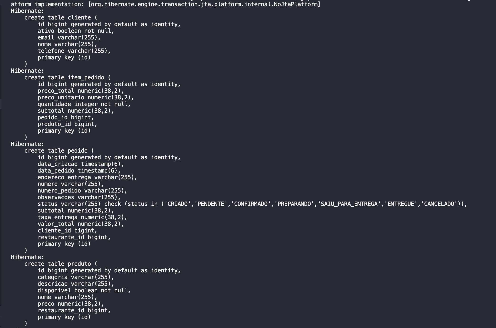
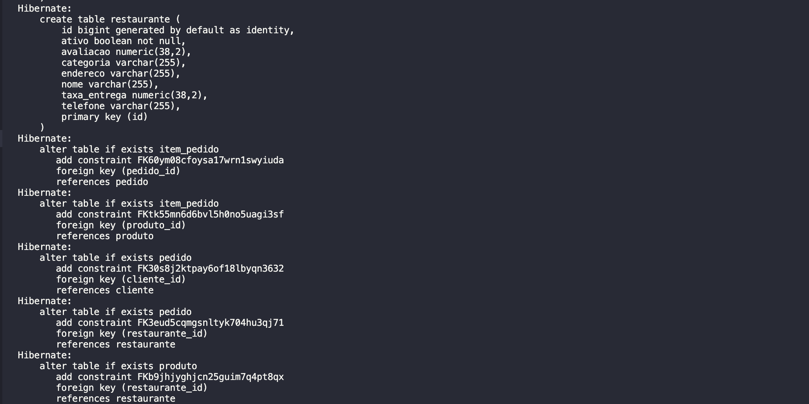
---

### 2.2 Validação das Consultas

No método `run()` do `DataLoader`, são executadas chamadas aos métodos dos repositórios para:

- [x] **Consultar e exibir todos os clientes**
- [x] **Listar restaurantes ativos**
- [x] **Filtrar produtos por restaurante**
- [x] **Verificar pedidos e itens associados**
- [x] **Testar consultas derivadas e com `@Query`**

>As informações são impressas no console para facilitar a análise e validação.

---

## 📸 Exemplo de Saída no Console

##
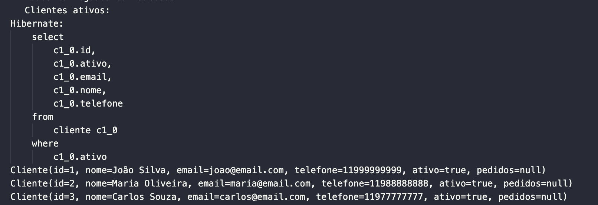

##


##
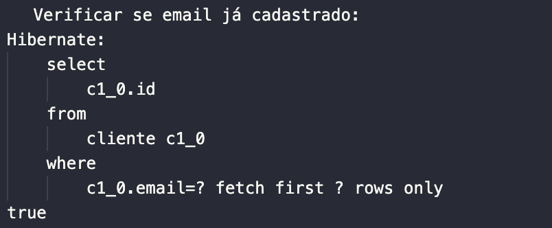

##
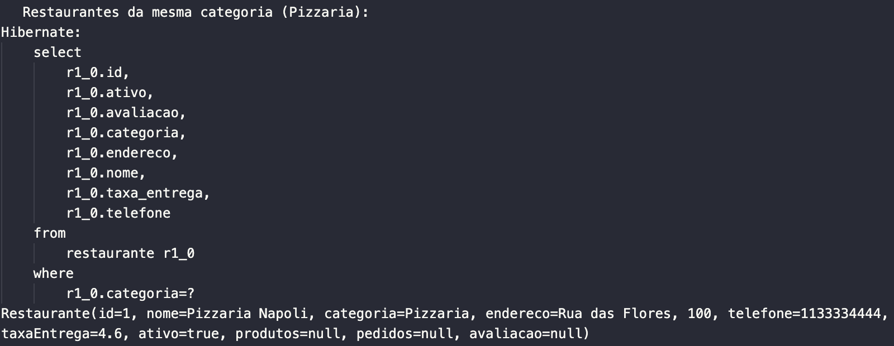

##
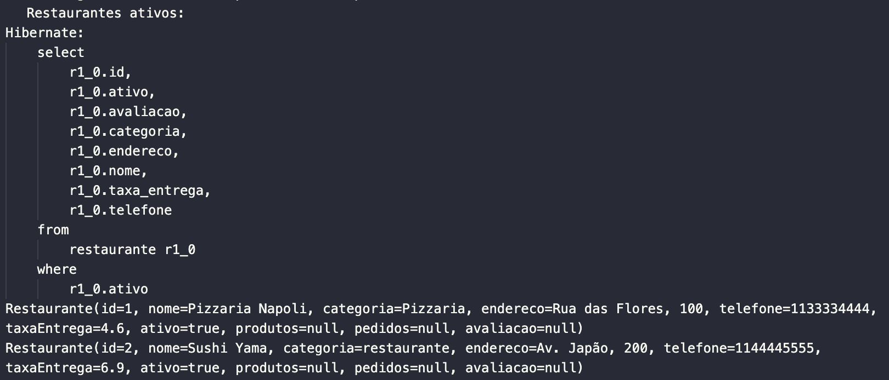

##
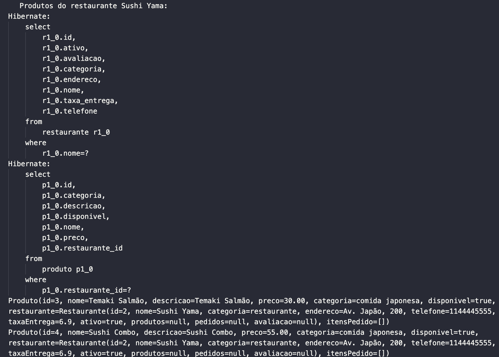

##
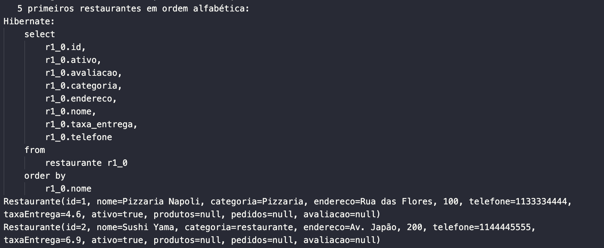

##
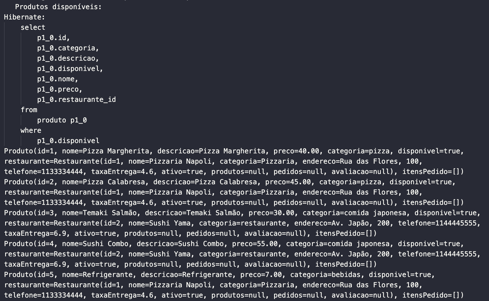

##
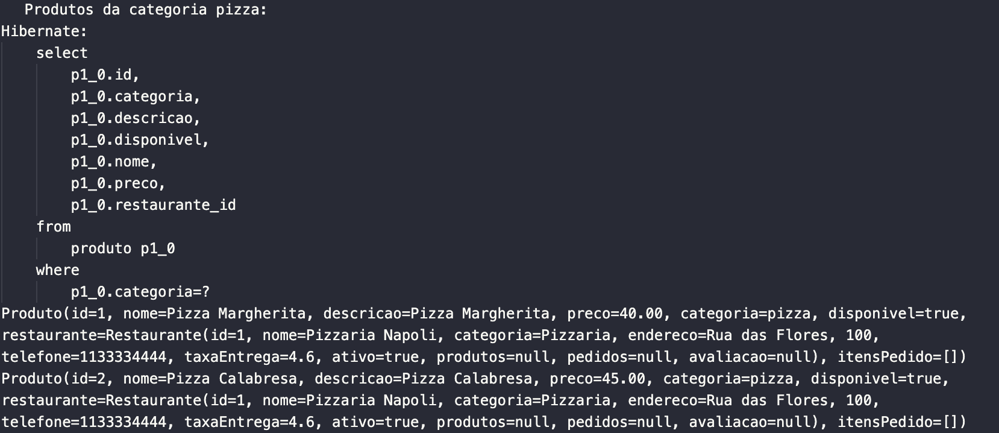

##
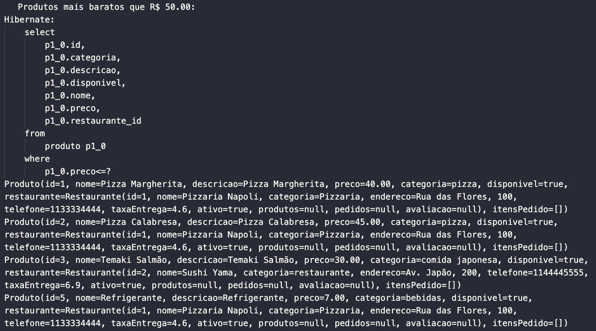

##
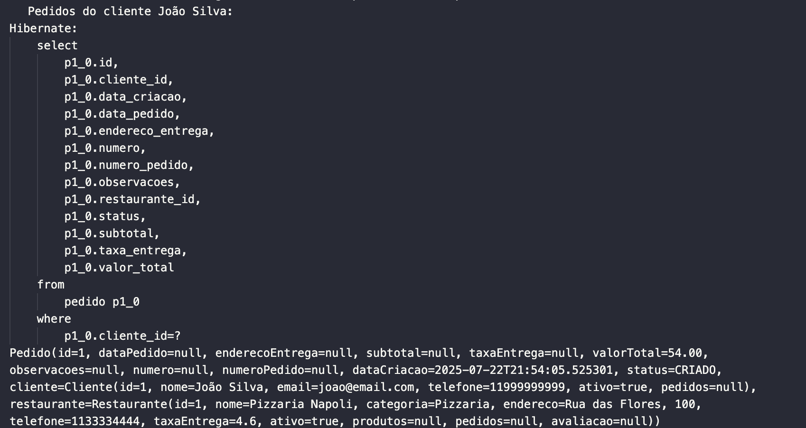

##
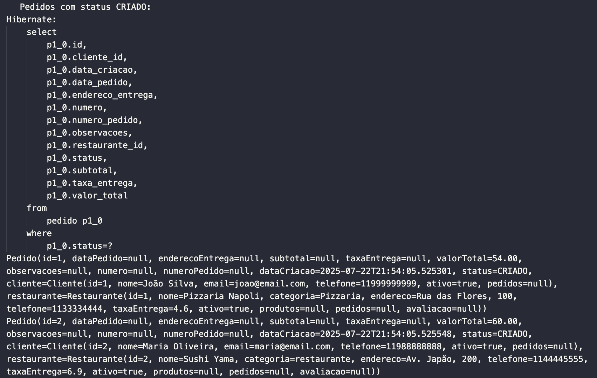

##
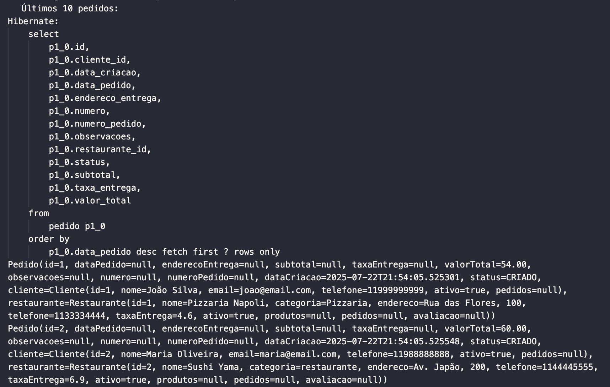

##
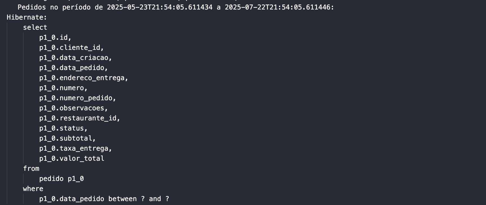


---

## 📁 Estrutura dos Arquivos

```bash
.
├── src
│   ├── main
│   │   ├── java
│   │   │   └── com
│   │   │       └── deliverytech
│   │   │           └── delivery
│   │   │               ├── DeliveryApiApplication.java
│   │   │               ├── config
│   │   │               │   └── DataLoader.java
│   │   │               ├── controller
│   │   │               │   ├── ClienteController.java
│   │   │               │   ├── PedidoController.java
│   │   │               │   ├── ProdutoController.java
│   │   │               │   ├── README.MD
│   │   │               │   ├── RestauranteController.java
│   │   │               │   └── TesteController.java
│   │   │               ├── enums
│   │   │               │   └── StatusPedido.java
│   │   │               ├── model
│   │   │               │   ├── Cliente.java
│   │   │               │   ├── ItemPedido.java
│   │   │               │   ├── Pedido.java
│   │   │               │   ├── Produto.java
│   │   │               │   └── Restaurante.java
│   │   │               ├── repository
│   │   │               │   ├── ClienteRepository.java
│   │   │               │   ├── PedidoRepository.java
│   │   │               │   ├── ProdutoRepository.java
│   │   │               │   ├── README.MD
│   │   │               │   └── RestauranteRepository.java
│   │   │               ├── security
│   │   │               └── service
│   │   │                   ├── ClienteService.java
│   │   │                   ├── PedidoService.java
│   │   │                   ├── ProdutoService.java
│   │   │                   ├── README.MD
│   │   │                   └── RestauranteService.java
│   │   └── resources
│   │       ├── application copy.properties1
│   │       ├── application.properties
│   │       ├── static
│   │       └── templates


```

---

## 🧪 Como testar

1. Execute a aplicação normalmente:

```bash
./mvnw spring-boot:run
```