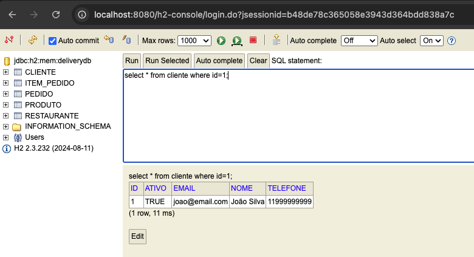
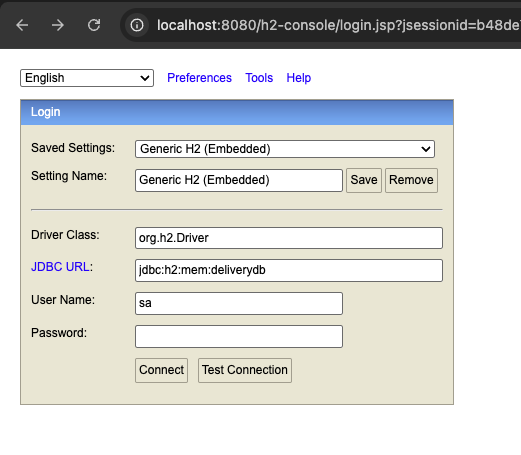

## 🛠️ 3. Configurações

As configurações da aplicação foram ajustadas para facilitar o desenvolvimento e a depuração da persistência com JPA/Hibernate.

### ✅ `application.properties` configurado:

```bash
# H2 Database
spring.datasource.url=jdbc:h2:mem:delivery-db
spring.datasource.driver-class-name=org.h2.Driver
spring.datasource.username=sa
spring.datasource.password=

# JPA / Hibernate
spring.jpa.database-platform=org.hibernate.dialect.H2Dialect
spring.jpa.hibernate.ddl-auto=create-drop
spring.jpa.show-sql=true
spring.jpa.properties.hibernate.format_sql=true

# H2 Console
spring.h2.console.enabled=true
spring.h2.console.path=/h2-console
```
---
### 📜 Logs SQL Ativos

<p>Com as opções `spring.jpa.show-sql=true` e `hibernate.format_sql=true`, os comandos SQL gerados pelo Hibernate são exibidos formatados no console.</p>

#### Exemplo:

```sql
select * from cliente where id=1;
insert into restaurante (...)
```

---


---

## 🖥️ Console H2 Habilitado

>O console web do H2 pode ser acessado via:

📍 http://localhost:8080/h2-console


| DBC URL: | jdbc:h2:mem:delivery-db |
|----------|-------------------------|
| User:    | sa           |
| Password: | (em branco) |

---



---
## ✅ Estrutura validada

A aplicação foi executada com sucesso, os dados foram persistidos corretamente e as consultas funcionam como esperado. O console e os logs auxiliam na verificação da integridade da base e da lógica implementada.