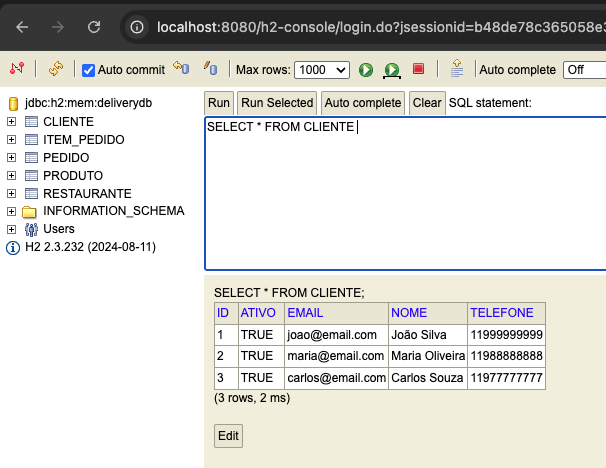
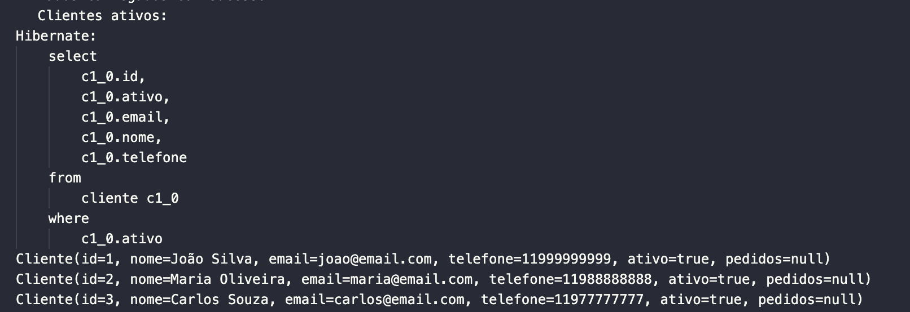

## 📸 4. Evidências

A seguir, são apresentadas as evidências que comprovam o correto funcionamento da aplicação, persistência dos dados e execução das consultas.

###  Console H2

Acessado via: `http://localhost:8080/h2-console`

📌 **Configuração:**
- JDBC URL: `jdbc:h2:mem:delivery-db`
- User: `sa`

**Exemplo de visualização da tabela `cliente`:**



---

###  Logs de Execução

O console do Spring Boot exibe os comandos SQL executados automaticamente, o que comprova a persistência dos dados e as consultas sendo processadas:

```bash
Hibernate: 
    create table cliente (
        id bigint generated by default as identity,
        ativo boolean not null,
        email varchar(255),
        nome varchar(255),
        telefone varchar(255),
        primary key (id)
    )
Hibernate: 
    create table item_pedido (
        id bigint generated by default as identity,
        preco_total numeric(38,2),
        preco_unitario numeric(38,2),
        quantidade integer not null,
        subtotal numeric(38,2),
        pedido_id bigint,
        produto_id bigint,
        primary key (id) ...
```
---

### Resultados no Console

Durante a execução do DataLoader, as consultas foram validadas e os resultados exibidos no terminal:

---


##


---

### Validação de Relacionamentos

Foram validadas no console as relações entre entidades:

- Um pedido com vários itens
- Um restaurante com seus produtos
- Um cliente associado ao pedido

#### Exemplo:


---


