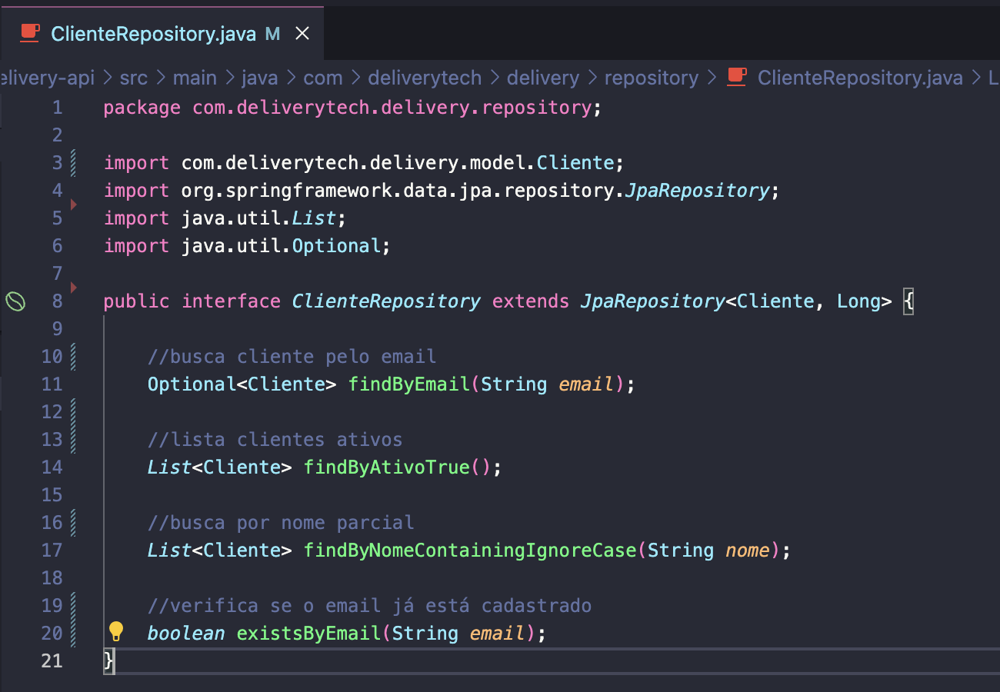
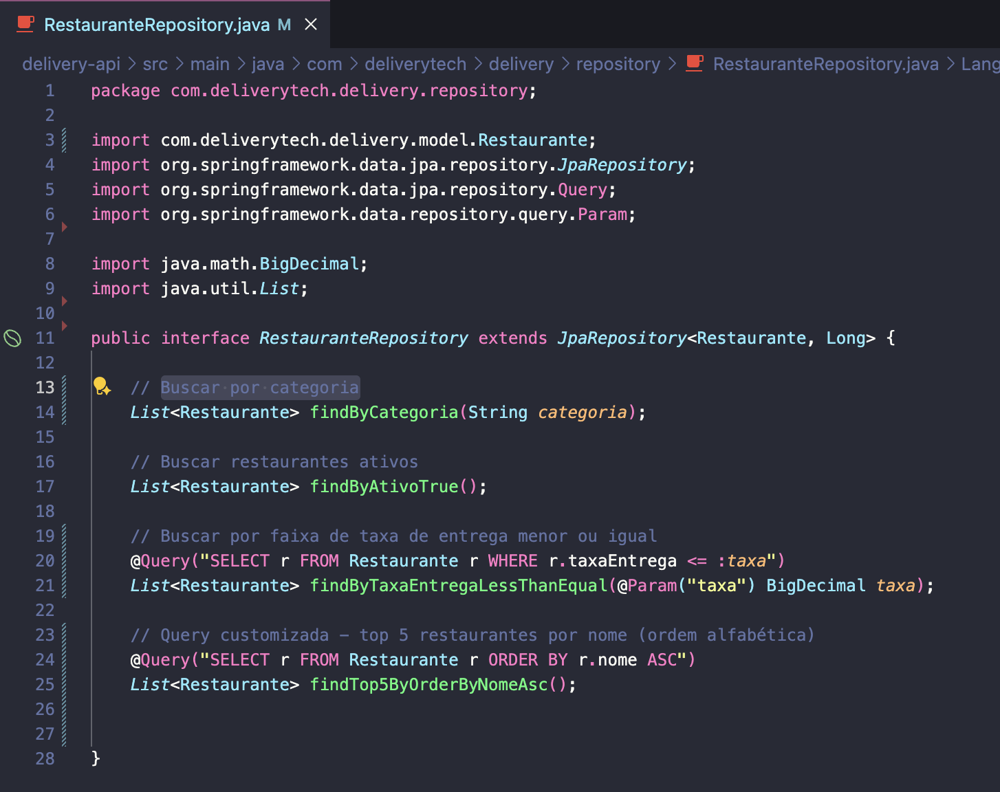
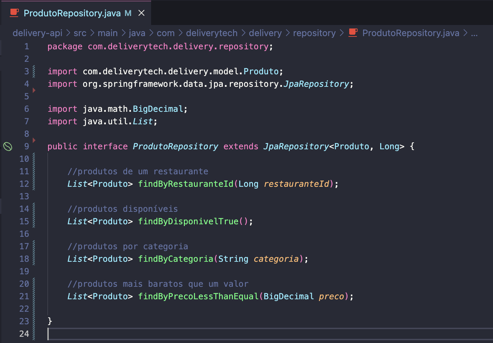
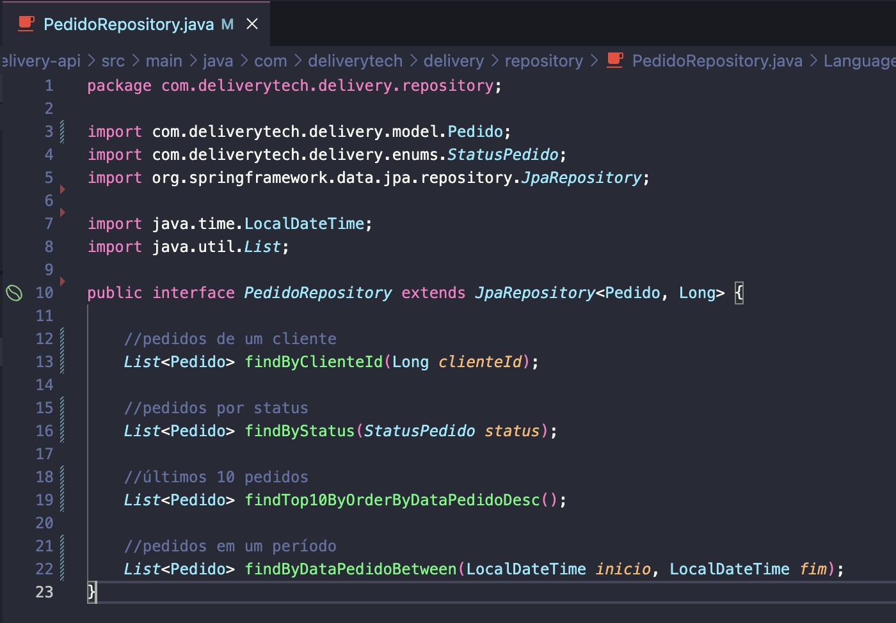

## 🗂️ Atividade 1 - Código Fonte dos Repositórios

### 📁 ClienteRepository

---
- `findByEmail(String email)` → busca cliente pelo email
- `findByAtivoTrue()` → lista clientes ativos
- `findByNomeContainingIgnoreCase(String nome)` → busca por nome parcial
- `existsByEmail(String email)` → verifica se o email já está cadastrado

### 📁 RestauranteRepository

---
- `findByCategoria(String categoria)` → restaurantes da mesma categoria
- `findByAtivoTrue()` → restaurantes ativos
- `findByTaxaEntregaLessThanEqual(BigDecimal taxa)` → restaurantes com taxa menor ou igual
- `findTop5ByOrderByNomeAsc()` → 5 primeiros restaurantes em ordem alfabética

### 📁 ProdutoRepository

---
- `findByRestauranteId(Long restauranteId)` → produtos de um restaurante
- `findByDisponivelTrue()` → produtos disponíveis
- `findByCategoria(String categoria)` → produtos por categoria
- `findByPrecoLessThanEqual(BigDecimal preco)` → produtos mais baratos que um valor

### 📁 PedidoRepository

---
- `findByClienteId(Long clienteId)` → pedidos de um cliente
- `findByStatus(StatusPedido status)` → pedidos por status
- `findTop10ByOrderByDataPedidoDesc()` → últimos 10 pedidos
- `findByDataPedidoBetween(LocalDateTime inicio, LocalDateTime fim)` → pedidos em um período
- `@Query` → total de pedidos por cliente
